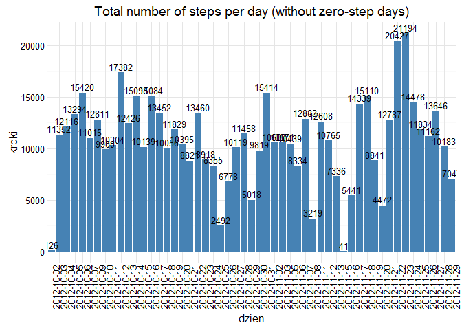
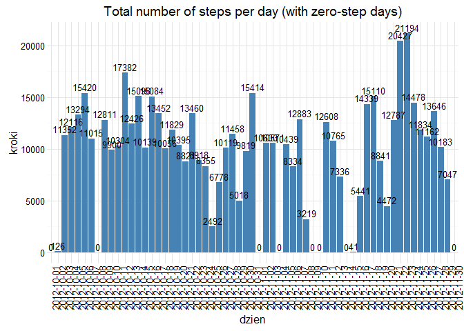

# Reproducible Research: Peer Assessment 1

## Loading and preprocessing the data

```r
library(ggplot2)
unzip(zipfile = "activity.zip")
activity <- read.csv("activity.csv")
kroki <- activity$steps
dzien <- activity$date
inter <- activity$interval
activity2 <- activity[!is.na(activity$steps),]
agregacja <- aggregate(list(kroki = kroki), list(dzien = dzien), FUN=sum)
agregacja2 <- aggregate(activity2$steps, list(activity2$interval), FUN=mean)
agregacjaZERO <- agregacja
agregacjaZERO[is.na(agregacjaZERO)] <- 0
agregacjaNA <- agregacja[!is.na(agregacja$kroki),]
```
## What is mean total number of steps taken per day?

```r
## I use data without NA, but including 'zero-step' days
ggplot(data=agregacjaNA, aes(agregacjaNA$kroki))+geom_histogram(breaks=seq(0,25000,by=5000),col="blue",aes(fill=..count..))+scale_fill_gradient("count", low="white", high="red")+ggtitle("Histogram total number of steps without NA's")
```

\

```r
summary(agregacjaNA$kroki)
```

```
##    Min. 1st Qu.  Median    Mean 3rd Qu.    Max. 
##      41    8841   10760   10770   13290   21190
```

```r
ggplot(data=agregacjaZERO, aes(agregacjaZERO$kroki))+geom_histogram(breaks=seq(0,25000,by=5000),col="blue",aes(fill=..count..))+scale_fill_gradient("count", low="white", high="red")+ggtitle("Histogram total number of steps with NA's")
```

\

```r
summary(agregacja$kroki)
```

```
##    Min. 1st Qu.  Median    Mean 3rd Qu.    Max.    NA's 
##      41    8841   10760   10770   13290   21190       8
```

```r
agregacjaAVG <- mean(agregacjaNA$kroki)
agregacjaMEDIAN <- median(agregacjaNA$kroki)

agregacjaAVG  # mean number of steps taken per day
```

```
## [1] 10766.19
```

```r
agregacjaMEDIAN  # median number of steps taken per day
```

```
## [1] 10765
```

## What is the average daily activity pattern?

```r
plot(agregacja2$Group.1, agregacja2$x, type = "l",xlab="interval",ylab="avarage number of steps per day")
```

\

```r
maximumSteps <- agregacja2[which.max(agregacja2$x),1]
maximumSteps # maximum steps during day in 5 munites period
```

```
## [1] 835
```

```r
ggplot(data = agregacjaNA, aes(x=dzien, y=kroki))+geom_bar(stat = "identity", fill="steelblue")+geom_text(aes(label=kroki),vjust=-0.3, size=3.5)+theme_minimal()+theme(axis.text.x = element_text(angle=90,hjust = 1))+ggtitle("Total number of steps per day (without zero-step days)")
```

\

```r
ggplot(data = agregacjaZERO, aes(x=dzien, y=kroki))+geom_bar(stat = "identity", fill="steelblue")+geom_text(aes(label=kroki),vjust=-0.3, size=3.5)+theme_minimal()+theme(axis.text.x = element_text(angle=90,hjust = 1))+ggtitle("Total number of steps per day (with zero-step days)")
```

\
## Imputing missing values

```r
val1 <- nrow(activity)
val2 <- nrow(activity2)
val1 - val2
```

```
## [1] 2304
```


## Are there differences in activity patterns between weekdays and weekends?
