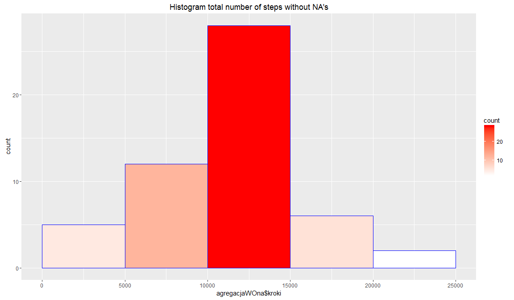
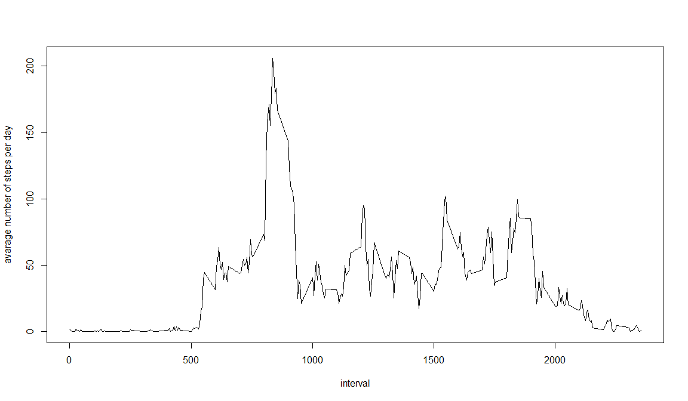
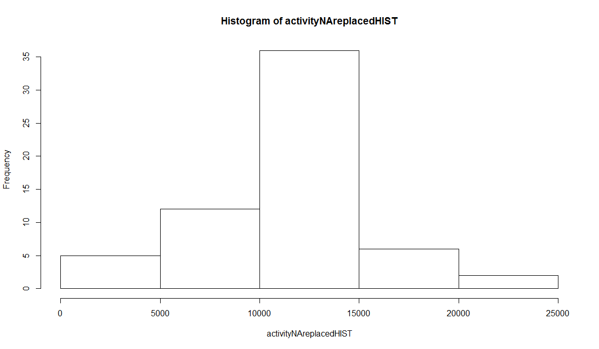
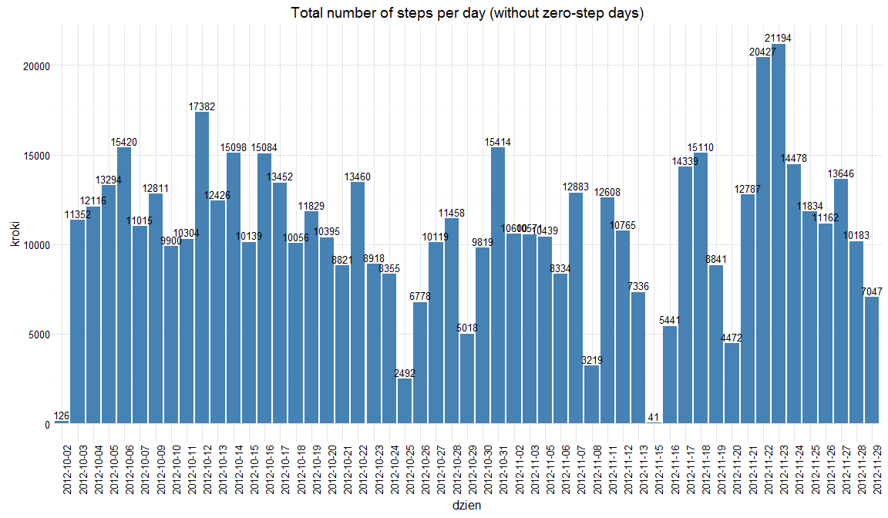
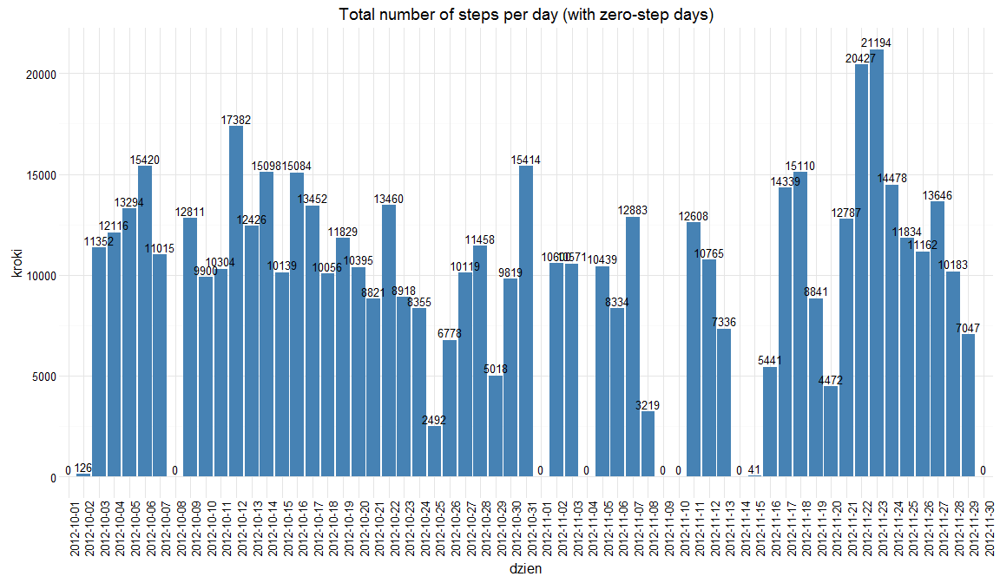
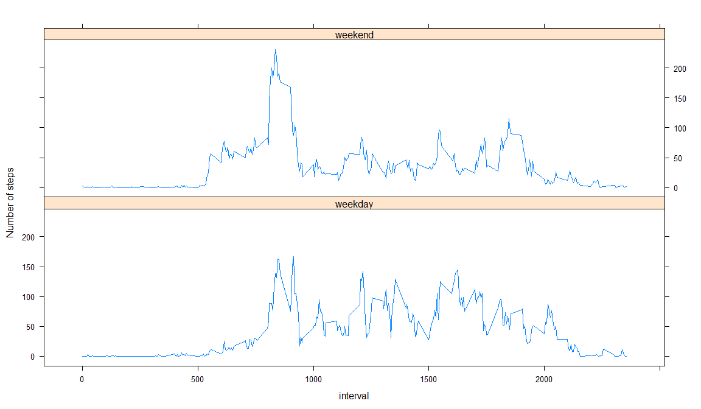

# Reproducible Research: Peer Assessment 1

## Loading and preprocessing the data

```r
library(ggplot2)
library(timeDate)
library(lattice)
unzip(zipfile = "activity.zip")
activity <- read.csv("activity.csv")
kroki <- activity$steps
dzien <- activity$date
inter <- activity$interval
activityWOna <- activity[!is.na(kroki),]
agregacja <- aggregate(list(kroki = kroki), list(dzien = dzien), FUN=sum)
agregacja2 <- aggregate(activityWOna$steps, list(activityWOna$interval), FUN=mean)
agregacja3 <- aggregate(activity$steps, list(activity$interval), mean, na.rm=T)
agregacjaZERO <- agregacja
agregacjaZERO[is.na(agregacjaZERO)] <- 0
agregacjaWOna <- agregacja[!is.na(agregacja$kroki),]
```
## What is mean total number of steps taken per day?

```r
## I use data without NA, but including 'zero-step' days
ggplot(data=agregacjaWOna, aes(agregacjaWOna$kroki))+geom_histogram(breaks=seq(0,25000,by=5000),col="blue",aes(fill=..count..))+scale_fill_gradient("count", low="white", high="red")+ggtitle("Histogram total number of steps without NA's")
```

\

```r
summary(agregacjaWOna$kroki)
```

```
##    Min. 1st Qu.  Median    Mean 3rd Qu.    Max. 
##      41    8841   10760   10770   13290   21190
```

```r
ggplot(data=agregacjaZERO, aes(agregacjaZERO$kroki))+geom_histogram(breaks=seq(0,25000,by=5000),col="blue",aes(fill=..count..))+scale_fill_gradient("count", low="white", high="red")+ggtitle("Histogram total number of steps with NA's")
```

\

```r
summary(agregacja$kroki)
```

```
##    Min. 1st Qu.  Median    Mean 3rd Qu.    Max.    NA's 
##      41    8841   10760   10770   13290   21190       8
```

```r
agregacjaAVG <- mean(agregacjaWOna$kroki)
agregacjaMEDIAN <- median(agregacjaWOna$kroki)

agregacjaAVG  # mean number of steps taken per day
```

```
## [1] 10766.19
```

```r
agregacjaMEDIAN  # median number of steps taken per day
```

```
## [1] 10765
```

## What is the average daily activity pattern?

```r
plot(agregacja2$Group.1, agregacja2$x, type = "l",xlab="interval",ylab="avarage number of steps per day")
```

\

```r
maximumSteps <- agregacja2[which.max(agregacja2$x),1]
maximumSteps # maximum steps during 5 munite period
```

```
## [1] 835
```
## Imputing missing values

```r
val1 <- nrow(activity)
val2 <- nrow(activityWOna)
#Total number of NA's in the dataset
val1 - val2
```

```
## [1] 2304
```

```r
activityNAreplaced <- activity
for (i in 1:nrow(activityNAreplaced)) {
  if (is.na(activityNAreplaced[i,1])) {
    activityNAreplaced[i,1] <- agregacja3[agregacja3$Group.1==activity[i,3],2]
  }
}

activityNAreplacedHIST <- tapply(activityNAreplaced$steps, activityNAreplaced$date, sum)
hist(activityNAreplacedHIST)
```

\

```r
summary(activityNAreplacedHIST)
```

```
##    Min. 1st Qu.  Median    Mean 3rd Qu.    Max. 
##      41    9819   10770   10770   12810   21190
```

```r
ggplot(data = agregacjaWOna, aes(x=dzien, y=kroki))+geom_bar(stat = "identity", fill="steelblue")+geom_text(aes(label=kroki),vjust=-0.3, size=3.5)+theme_minimal()+theme(axis.text.x = element_text(angle=90,hjust = 1))+ggtitle("Total number of steps per day (without zero-step days)")
```

\

```r
ggplot(data = agregacjaZERO, aes(x=dzien, y=kroki))+geom_bar(stat = "identity", fill="steelblue")+geom_text(aes(label=kroki),vjust=-0.3, size=3.5)+theme_minimal()+theme(axis.text.x = element_text(angle=90,hjust = 1))+ggtitle("Total number of steps per day (with zero-step days)")
```

\


## Are there differences in activity patterns between weekdays and weekends?

```r
Sys.setlocale("LC_TIME", "English")
```

```
## [1] "English_United States.1252"
```

```r
activityWEEKDAY <- activityNAreplaced
activityWEEKDAYvect <- as.Date(activityNAreplaced$date)
activityWEEKDAYvect <- ifelse(weekdays(activityWEEKDAYvect) %in% c('Saturday','Sunday'), 'weekday', 'weekend')
activityWEEKDAY <- cbind(activityWEEKDAY, activityWEEKDAYvect)

activityWEEKDAYplot <-aggregate(list(steps=activityWEEKDAY$steps), list(daytype = activityWEEKDAY$activityWEEKDAYvect, interval = activityWEEKDAY$interval), mean, na.rm=T)
xyplot(steps ~ interval | daytype , data = activityWEEKDAYplot, layout = c(1, 2), type="l", ylab="Number of steps")
```

\


